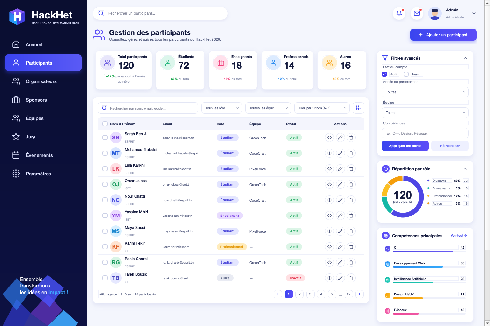

# 🎓 HackHet — Gestion des participants

Admin dashboard **pixel-faithful** pour gérer les participants du HackHet 2026 — construit en **un seul fichier Python runnable** avec **PySide6 (Qt)**.



## ✨ Aperçu

| Élément | Détail |
|---|---|
| 🧭 Sidebar | 272 px, logo cristal dessiné en `QPainter`, navigation (Accueil, Participants actif, Organisateurs, Sponsors, Équipes, Jury, Évènements, Paramètres) + carte déco « Ensemble, transformons les idées en impact ! » |
| 🔝 Top bar | Recherche globale, notifications/messages avec pastilles, profil Admin |
| 📊 Stats | 5 cartes : Total 120 (+12 %), Étudiants 72 (60 %), Enseignants 18 (15 %), Professionnels 14 (12 %), Autres 16 (13 %) |
| 📋 Table participants | Toolbar (recherche, filtres rôle/équipe, tri A-Z, bouton sliders), 10 lignes / page, badges de rôle/statut, 3 actions par ligne (voir / éditer / supprimer), pagination 1–12 |
| 📌 Panneau droit (322 px) | Filtres avancés (Actif/Inactif, année, équipe, compétences + Appliquer / Réinitialiser), Donut Répartition par rôle (120 participants), Compétences principales (C++, Web, IA, UI/UX, Réseaux) avec barres |

Toutes les icônes sont des **SVG Feather inline** rendus via `svg_pixmap()`, logo / donut / barres / avatars / déco en `QPainter`. Style 100 % `QSS` en pixels entiers, ombres douces `QGraphicsDropShadowEffect`.

## 🚀 How to use

### 1. Prérequis

- Python **3.10+**
- PySide6

```bash
pip install PySide6
```

### 2. Lancer

```bash
python hackhet_dashboard.py
```

> Fenêtre recommandée : **1536 × 1024** (minimum 1180 × 720).

### 3. Fonctionnalités interactives

- 🔍 **Recherche live** — par nom, email, école (toolbar + top bar)
- 🎯 **Filtres** — par rôle, par équipe, par statut (panneau Filtres avancés → *Appliquer les filtres* / *Réinitialiser*)
- ↕️ **Tri** — Nom (A-Z / Z-A)
- 📄 **Pagination** — 10 participants par page, 120 au total, label « Affichage de 1 à 10 sur 120 participants »
- 📦 **Cartes repliables** — Filtres avancés, Répartition par rôle
- ✅ **Sélection** — checkbox d'en-tête + lignes

## 🗂️ Structure

```
.
├── hackhet_dashboard.py   # tout l'app : UI + logique + données démo (120 participants générés)
├── screenshot.png         # capture finale (1536×1024)
└── README.md
```

Aucune ressource externe — zéro fichier image, zéro `.ui`, zéro CSS externe.

## 🛠️ Tech

- **PySide6** — Qt Widgets uniquement (`QMainWindow`, layouts, `QSS`, `QGraphicsDropShadowEffect`)
- **QPainter** — logo hexagone, donut (72 / 18 / 14 / 16), barres de compétences (valeur / 51), avatars initiales, déco sidebar
- **Données démo** — 10 participants réels + 110 générés procéduralement (noms tunisiens, ESPRIT / ISET, équipes GreenTech / CodeCraft / PixelForce)

## 📸 Screenshot

Prise depuis l'app réelle :

```bash
python hackhet_dashboard.py
```

Le fichier `screenshot.png` est un `grab()` pleine fenêtre en 1536×1024.

## 📄 License

MIT — libre pour usage hackathon / pédagogique.
